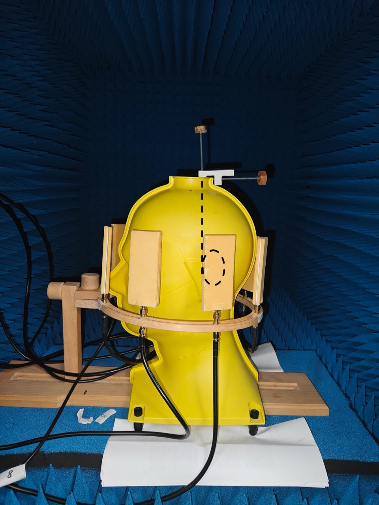

# Stroke Finder - MATLAB Measurement Tool
## Project description
This project is part of my bachelor's thesis in Telecommunication Engineering, focused on the development of a non-invasive system able to detect **intracranical hemorrhages (ICH)**  and **ischemic strokes (IS)** using microwaves.

The system uses a pair of antennas connected to a VNA (Vector Network Analyzer), Rohde & Schwarz ZNB4, a head phantom that emulates the dielectric properties of human skull, which is filled with a liquid able to emulate the average dielectric properties of brain tissues, and eventually stroke-mimicking objects, created using salt, isopropyl alcohol and demineralized water used in different percentages for each of the two strokes.

Around the head phantom there's the helmet, composed of 8 antennas, which are connected to a side panel, mounted on the anechoic chamber.
The chamber houses the head phantom and is used to minimize the external electromagnetic interferences, ensuring more accurate measurements.

  

## Experimental configurations
Since the final goal of this project is to develop a portable, non-invasive, fast, and more affordable alternative to MRI/CT scans for detecting intracerebral hemorrhages (ICH) and ischemic strokes (IS), I used the measurements collected with this program to train a machine learning model.

To achieve reliable results, I needed a wide range of possible stroke scenarios for both conditions, which is why I varied the experimental configurations.

- Head Phantom:  
	- Tilted: the head phantom's nose is placed between antenna 1 and 8
     - Not tilted: the head phantom is slightly rotated (~30°), so now the nose is placed on antenna 8
-  Stroke location:
	- Internal/External: This parameter defines the stroke's position relative to the vertical axis of the head phantom. 
		-  Internal: the stroke is placed along the vertical axis of the head phantom, 
		-  External: the stroke is positioned away from the vertical axis of the head, towards the outer region of the phantom.
	- Height: Refers to the depth of the stroke within the head phantom. 
		- Height 1: the stroke is located above the antenna helmet (~9.5cm depth), 
		- Height 2: the stroke is positioned in between the antenna plane (~15cm depth). 
		
	- Application point: There are 4 application points around the phantom. They correspond to angular positions of 0°, 90°, 180° and 270°, respectively, and are labeled as points 1,2,3 and 4
		
	These configurations apply only to the two pathological conditions: ICH and IS. Instead, for the healthy case, there's no stroke placed inside the phantom -- since is rappresented by the liquid inside the head -- so the only parameter that changes is the phantom orientation.

All these configurations lead to a total of:
`2 (ext/int) x 2 (heights) x 4 (application points) = 16 configurations per stroke type ->  which makes 32 configurations when considering both pathological conditions.`
Each of these configurations is repeated for 2 phantom inclinations.
Finally, there are 2 more configurations for the healthy case, one for each phantom inclination, where no stroke is present.

Examples of two configurations

| Stroke placed on application point number 1 (0°), internally, at height 1 | Stroke placed on application point number 3 (180°), externally, at height 2 |
|------------------|------------------|
|  |  |

Top view showing the antenna configuration and application points numbering

##  MATLAB Code Overview
1) 🎛️ **Remote control of the VNA**   
The code allows the user to remotely control the VNA, which must be connected to the same LAN as the laptop.
For istance, I use a static IP configuration for both devices, which are directly connected to a router using CAT5e ethernet cable.
2) 🧩 **Required drivers for LAN communication** 
To enable communication between the laptop and the VNA, you have to install specific drivers from the following link: `https://www.tek.com/en/support/software/driver/tekvisa-connectivity-software-v411`.
After installing the TekVISA software, a set of tool will be available, including "OpenChoice Instrument Manager", which can be used to detect and verify the connection with the VNA. If the connection between the router, the laptop and the VNA is done correctly, the VNA should appear in the instrument manager.

3) 📡 **Manual switching of antennas**
Unfortunately, I didn't have access to a switching matrix to automate the antenna selection, and since the Rohde & Schwarz ZNB4 VNA has only 2 ports, I had to manually switch antennas in order to acquire all the S-parameters between the different antenna pairs (e.g. S11, S12, S13, ... ,S88). 
So this leads the user to manually change the configurations parameters in the code before each new measurement.
4) 🗂️ **Saving mechanism and folter hierarchy** 
The measurements are saved in a structured folder hierarchy, and are organized in this way:
	- Pathological cases: `measurements/tilted/ISCH/height2_point4_ext/S35/S12_Ant3-Ant5_ISCH_point4_02.mat`

	- Healthy case: `measurements/nottilted/HEALTHY/S57/S12_Ant5-Ant7_HEALTHY_06.mat`
	
	Of course this is only an example, the folders and the file names are generated automatically based on the parameters selected in the code. 

5) 🔁 **Measurement loop**
The code includes a for-loop that allows you to repeat the measurement of a single configuration multiple times, by doing that you can capture possible variations of S-parameters (like S12) over time.
Note that increasing the number of repetitions will also increase the total duration of the measurement process.

## Author
*Riccardo Marra*,
 Università degli Studi di Roma "Tor Vergata",
 email: rmarra2002@gmail.com

